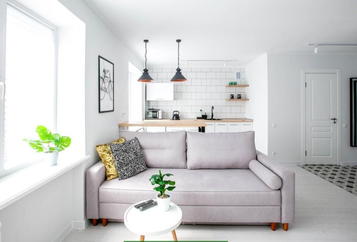
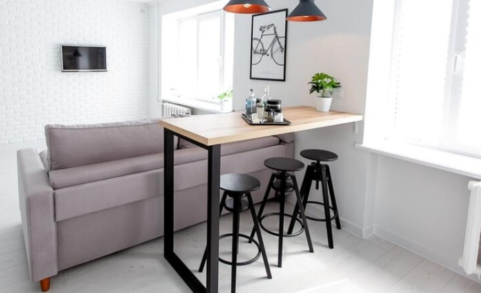
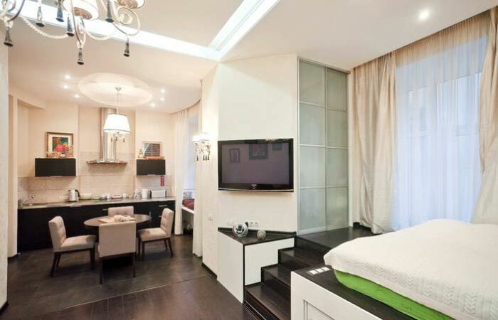
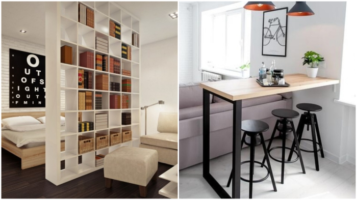

# Some smart zoning ideas for studio apartments that will almost magically expand the space

A studio apartment is a solution for the modern European. More and more people opt for such an apartment: it is easier to clean, it is more comfortable to live in, everything is at hand. In this material - 5 ideas for excellent zoning for the housing preference of modern individualists.

## Sofa with its back to the kitchen area

Modern sofa can serve to define the boundaries of adjacent zones, while the owner of the studio does not lose a single centimeter of usable space and does not spend money on the purchase of screens. It's enough, for example, to put a sofa with its back to the dining room or kitchen area and it will be clear where the boundary lies between them.

## Coffee bar area adjacent to the back of the sofa

A great solution is a bar counter, which separates the kitchen area from the living room, and also serves as a dining table and an additional work surface (to work on your laptop). By the way, under it you can also store something useful. Thus, the dining table, coffee table, coffee table and coffee table is now one table.

##  A high through shelf that acts as both a wall and a storage area

A high through-shelf will be able to separate the bedroom from the living room and still perform its direct function of storing any needed items. The illusion of a wall is absolute, while not having to waste space installing dressers, while making the space more environmentally friendly, although it takes a little more time to wipe off the dust.

##  Zoning with a catwalk

The bed can be placed on the podium - this will highlight the sleeping area, and also allows you to organize additional storage space under the bed, thus killing two birds with one stone - and zoning is done, and the under-bed storage area takes away the headache.

##  Zoning with carpets

With carpet zoning, a certain zone is not fixed to a specific space of the apartment: from now on, it is easy to move it by simply moving the carpet. Observe the color combination for the carpet and furniture of the selected area. For such zoning to be as effective as possible, ideally you should place all the furniture of a particular zone around a single rug.

